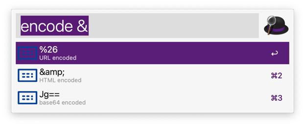
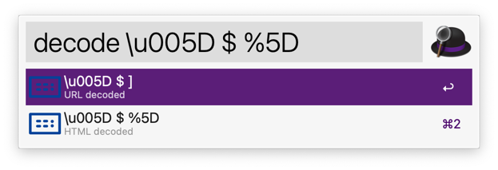

# alfred-workflow-encode-decode

alfred-workflow-encode-decode is a workflow for Alfred 3 / 4 / 5, which can encode/decode string.

It was inspired by [willfarrell/alfred-encode-decode-workflow: Encoding and decoding a string into multiple variations.](https://github.com/willfarrell/alfred-encode-decode-workflow/tree/master).

**Why another one**

Because `willfarrell/alfred-encode-decode-workflow` required `php@7`, and macOS removed php@7 now.

## Install

1. Open [Release](https://github.com/alswl/alfred-workflow-encode-decode/releases), and download the latest version.
2. Click to install.
3. Review the workflow to add custom Hotkeys.

## How to use

Trigger your Alfred, and input `encode` or `decode`, and input your string.

### Snapshots





## Development

Install dependencies:

```
pip install --target=. Alfred-PyWorkflow
rm -rf Alfred_PyWorkflow-*.dist-info
```

**package**:

```
make build package
```

## Related Projects

- [willfarrell/alfred-encode-decode-workflow: Encoding and decoding a string into multiple variations.](https://github.com/willfarrell/alfred-encode-decode-workflow)
- [alswl/shanbay-alfred2: 扇贝词典 alfred2/3/4 workflow, 支持查询和添加单词到自己词库。update：由于扇贝关闭开放 API，本项目已经不可正常工作。](https://github.com/alswl/shanbay-alfred2)
- [harrtho/alfred-pyworkflow: Full-featured library for writing Alfred 4 & 5 workflows](https://github.com/harrtho/alfred-pyworkflow)

## TODO

- [x] snapshots
- [ ] version management


